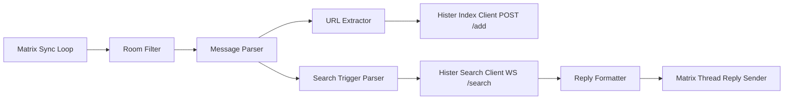

# Matrix Bot PoC Workings Plan

## Goal
Build a Matrix bot (using `mautrix/go`) that:

- Listens in multiple configured rooms (initial deployment may use one room).
- Detects HTTP/HTTPS URLs in messages and indexes them via Hister `POST /add`.
- Responds to search triggers:
- `/search <term>`
- `@bot <term>`
- `<term> @bot`
- Replies to the triggering message with top-5 compact search results from Hister WebSocket `/search`.
- Responds to `/catchmeup` by summarizing recent room messages with an LLM.

## PoC Scope
In scope:

- Message ingestion from Matrix rooms.
- Trigger parsing and URL extraction.
- Hister client for indexing and search.
- Threaded reply formatting.
- E2EE-capable architecture with persistent crypto/state storage.
- LLM-backed room catch-up summaries.

Out of scope:

- Full production HA/observability platform.
- Admin UI.
- Advanced ranking beyond backend-provided relevance.

## Architecture


## Package / File Layout (PoC)
```text
cmd/bot/main.go
internal/config/config.go
internal/bot/service.go
internal/matrix/client.go
internal/triggers/parse.go
internal/hister/client.go
internal/llm/llm.go
internal/storage/store.go
```

## Public Interfaces (lock these)
```go
type SearchResult struct {
    Title   string
    URL     string
    Snippet string
}

type SearchBackend interface {
    IndexURL(ctx context.Context, rawURL string) error
    Search(ctx context.Context, query string, limit int) ([]SearchResult, error)
}

type TriggerParser interface {
    ExtractSearchQuery(msg, botDisplayName string) (query string, ok bool)
    ExtractURLs(msg string) []string
}

type RoomPolicy interface {
    Allowed(roomID id.RoomID) bool
}
```

## Config Schema
```yaml
matrix:
  homeserver_url: "https://matrix.example.org"
  user_id: "@bot:example.org"
  access_token: "REDACTED"
  device_id: "BOTDEVICE1"         # optional
  bot_display_name: "bot"
  sync_timeout_ms: 30000
  allowed_room_ids:
    - "!abc123:example.org"

bot:
  search_command: "/search"
  max_results: 5
  reply_mode: "thread"
  max_query_len: 200

hister:
  base_url: "http://localhost:8080"
  add_path: "/add"
  search_ws_path: "/search"

http:
  request_timeout_ms: 10000

storage:
  state_db_path: "/var/lib/matrix-bot/state.db"
  crypto_db_path: "/var/lib/matrix-bot/crypto.db"
```

## Event Handling Rules
1. Handle only `m.room.message` text-like events.
2. Ignore events from the bot user itself.
3. Ignore events from rooms not in `allowed_room_ids`.
4. Always parse URLs and index unique `http://` or `https://` links.
5. Search trigger precedence:
6. `/search <term>`
7. `@bot <term>`
8. `<term> @bot`
9. If a search trigger exists, call Hister search and reply to the same event thread.
10. If body is `/catchmeup`, fetch up to 40 room text messages within the previous 24 hours, format as `Speaker: message`, send to LLM, and reply with generated output.

## Hister API Contract (PoC)
Index:

- `POST /add`
- JSON body minimum: `{ "url": "https://example.org/path" }`
- Success: `201 Created`

Search:

- WebSocket `GET /search`
- Send JSON payload with `text` query.
- Parse returned documents into `SearchResult`.

## PoC Control Flow (reference code shape)
```go
func onMessage(ctx context.Context, ev *event.Event) {
    if !roomPolicy.Allowed(ev.RoomID) || ev.Sender == cfg.Matrix.UserID {
        return
    }
    body := extractBody(ev)

    urls := parser.ExtractURLs(body)
    for _, u := range dedupe(urls) {
        _ = backend.IndexURL(ctx, u) // log failures, continue
    }

    q, ok := parser.ExtractSearchQuery(body, cfg.Matrix.BotDisplayName)
    if !ok {
        return
    }
    q = strings.TrimSpace(q)
    if q == "" || len(q) > cfg.Bot.MaxQueryLen {
        sendReply(ctx, ev, "Invalid search query.")
        return
    }

    results, err := backend.Search(ctx, q, cfg.Bot.MaxResults)
    if err != nil {
        sendReply(ctx, ev, "Search failed, please try again.")
        return
    }
    sendReply(ctx, ev, formatResults(q, results))
}
```

## Reply Format (PoC)
Threaded reply text:

1. Header: `Search results for: <query>`
2. Up to 5 results, each on one block:
3. `<n>. <title>`
4. `<url>`
5. Optional short snippet line if available.

## E2EE in PoC
Required from day one:

- Initialize `mautrix` crypto machine.
- Persist device/session/olm/megolm state in `crypto_db_path`.
- Persist sync and bot state in `state_db_path`.
- Startup must fail fast if crypto store init fails.

## Error Handling and Retry
- `POST /add`: timeout + up to 3 retries on transport/5xx.
- `/search` WS: reconnect with bounded backoff.
- Index errors are logged; search errors also return user-facing failure reply.

## Acceptance Tests
1. URL in allowed room triggers one `POST /add` call.
2. Two identical URLs in one message are indexed once.
3. `/search golang` sends threaded top-5 reply.
4. `@bot golang` sends threaded top-5 reply.
5. `golang @bot` sends threaded top-5 reply.
6. Non-allowlisted room causes no indexing/search behavior.
7. Bot-authored message is ignored.
8. Encrypted room message is decrypted and processed.
9. Backend timeout returns graceful error reply for search.

## Assumptions / Defaults
- Backend is direct Hister API (`/add`, `/search`).
- Multi-room support is required; room list is explicit allowlist.
- Result count default is 5.
- LLM credentials are provided via environment variables:
  - `OPENAI_API_KEY`
  - `OPENAI_BASE_URL`
- Runtime target is local binary/service first.
